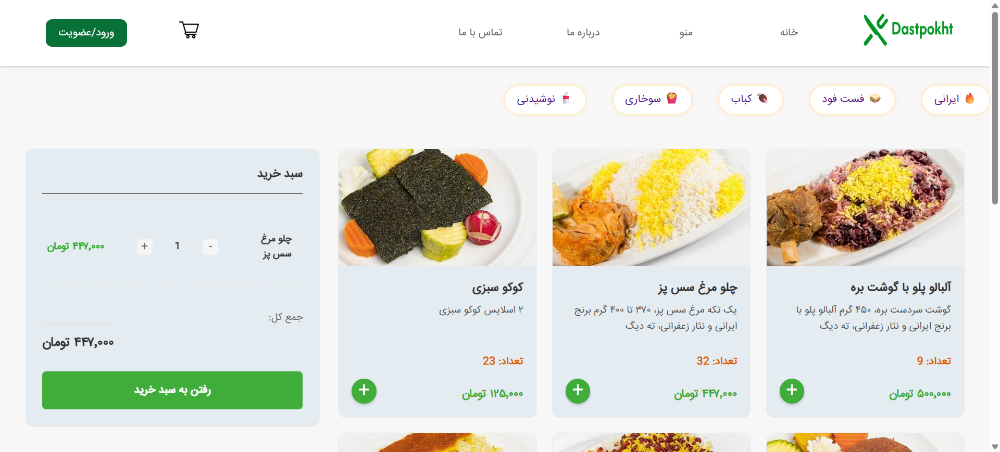
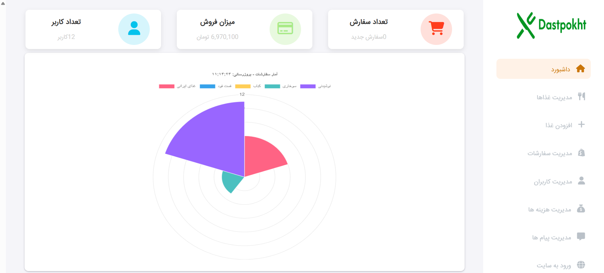

# Online Food Ordering System (MVP)

## 📌 Project Overview
This project is an **Online Food Ordering Website** developed as a **Minimum Viable Product (MVP)** within a limited time frame.  
The goal of the project is to provide a simple and functional system that allows users to browse food menus, place orders, and track order status, while enabling the restaurant administrator to manage foods, users, orders, and costs.

Due to time constraints and MVP scope, the project was implemented using a **simple architecture** without applying complex patterns such as MVC.

---

## 👥 Team Members & Roles

| Name | Role |
|---|---|
| Rahil Ahmadi | Scrum Master / Frontend Developer |
| Zahra Habibollahi | Backend Developer |
| Faizeh Ehsanfar | Database Manager / Backend Developer |
| Fatemeh Dadavand | UI Designer / Frontend Developer |

---

## ❓ Problem Statement
Traditional food ordering methods (phone calls or in-person ordering) often cause:
- Time consumption for customers and restaurants
- Human errors in order registration
- Lack of order tracking
- Poor centralized management of users and orders

There is a need for a **simple online system** that allows customers to place orders easily and enables restaurant administrators to manage all operations centrally.

---

## 💡 Proposed Solution
To address these issues, a web-based food ordering system was designed with two main sections:
1. **User Panel** for browsing food, placing orders, and tracking order status
2. **Admin Panel** for managing foods, users, orders, discounts, and delivery costs

The system focuses on core functionalities and delivers a working MVP.

---

## project preview

## food menu page

## Admin Dashboard



## 🛠 Technologies & Tools

### Frontend
- HTML
- CSS
- JavaScript

### Backend
- PHP
- MySQL
-JavaScript (AJAX for communicating with APIs)

### Database
- PHP MyAdmin
**Reason for selection:**
- Lightweight and simple
- Suitable for small to medium projects
- Supports relational data (users, orders, foods)

---

## 🗂 Project Structure
```text
Dastpokht2/
│
├── website/
│   │
│   ├── index.php                  # Main landing page
│   ├── login.php                  # User login logic
│   ├── register.php               # User registration logic
│   ├── shoppingCart.php           # Shopping cart backend
│   ├── sync_cart.php              # Sync cart data between client and server
│   ├── wallet.php                 # User wallet logic
│   ├── wallet_success.php         # Wallet payment success page
│   ├── order.php                  # Order placement logic
│   ├── process_payment.php        # Payment processing logic
│   │
│   ├── style.css                  # Main website styles
│   │
│   ├── Admin/                     # Admin panel
│   │   ├── index.html             # Admin landing page
│   │   ├── login.html             # Admin login page
│   │   ├── panel.php              # Admin dashboard
│   │   ├── users.php              # Users management page
│   │   ├── orders.php             # Orders management page
│   │   ├── shipping.php           # Shipping overview
│   │   ├── FoodManager.php        # Food/products management
│   │   ├── api_foods.php          # API endpoint for foods data
│   │   ├── getDashboardStats.php  # Fetch dashboard statistics
│   │   ├── get_messages.php       # Retrieve user messages
│   │   ├── delete_message.php     # Delete user messages
│   │   │
│   │   └── ...
│   │
│   ├── asset/                     # static assets
│   │       ├── font/               
│   │       ├── icon/
│   │       └── img/
│   │            └── FoodImage/
│   │      
│   ├── js                     # Retrieve user messages
│   │    ├── AddFood.js        # Handle adding new food items in admin panel
│   │    ├── chart.js          # Render charts and statistics for admin dashboard
│   │    ├── dargah.js         # Payment gateway client-side logic
│   │    ├── food.js           # Food listing and selection logic
│   │    ├── foodManager.js    # Admin-side food management interactions
│   │    ├── information.js    # Handle user information form actions
│   │    ├── login.js          # User login form validation and actions
│   │    ├── order.js          # Order submission and status handling
│   │    ├── register.js       # User registration form validation
│   │    ├── shipping.js       # Shipping management interactions (admin)
│   │    ├── shoppingCart.js   # Shopping cart client-side logic
│   │    ├── users.js          # Admin users management interactions
│   │    └── wallet.js         # Wallet charge and balance update logic
│   │
│   │                                            
│   ├── css/
│   │    ├── index.css          # Main styles for the home page
│   │    ├── about.css          # Styles for the About page
│   │    ├── contact.css        # Styles for the Contact page
│   │    ├── login.css          # Login page styles
│   │    ├── register.css       # User registration page styles
│   │    ├── panel.css          # User/Admin dashboard styles
│   │    ├── AddFood.css        # Styles for adding new food items
│   │    ├── food.css           # Food listing and details styles
│   │    ├── shoppingCart.css   # Shopping cart page styles
│   │    ├── orderStatus.css    # Order status and tracking styles
│   │    ├── wallet.css         # User wallet and balance styles
│   │    ├── information.css    # User information and profile styles
│   │    ├── dargah.css         # Payment gateway page styles
│   │        
│   │  
│   └── ...
│
└── README.md                      # Project documentation

---
## 🧱 Project Architecture 


The system is designed using a layered architecture to clearly separate responsibilities and improve maintainability.

### Layers of the System

#### 1. Presentation Layer
Responsible for displaying data and interacting with the user.

- PHP pages
- HTML/CSS layouts

Examples:
- food.php
- shoppingCart.php
- dargah.php
- CSS files

---

#### 2. Client Logic Layer (JavaScript)
Handles client-side interactions and logic.

- Shopping cart handling
- Quantity control
- AJAX communication
- Form validation

Examples:
- food.js
- shoppingCart.js
- dargah.js
- wallet.js

---

#### 3. Application / Business Logic Layer
Implements core system rules and workflows.

- Order processing
- Stock validation
- Payment handling
- Discount validation

Examples:
- process_payment.php
- check_stock.php
- check_discount.php
- sync_cart.php

---

#### 4. Data Layer
Responsible for data persistence and retrieval.

- MySQL database
- phpMyAdmin
- db.php

---

### Layer Communication Flow


---

## 🔍 Code Deep Dive

### Order Registration Process
1. User selects food items and submits the order
2. System validates user wallet or payment method
3. Order is saved in the database
4. Initial order status is set (e.g., "Registered")

### Order Status Management (Admin Side)
1. Admin reviews orders
2. Admin updates order status (Preparing / Sent / Cancelled)
3. In case of cancellation, the wallet balance is refunded


---

## 🧩 Conceptual Class Design (Deep Dive 2)

Although the project does not use Object-Oriented Programming classes,
it is structured using **conceptual classes**, where each module represents
a logical responsibility within the system.

---

### 1. User Management Class
**Responsibilities:**
- User authentication
- Session handling
- Wallet management

**Files:**
- register.php
- ActionLogin.php
- SessionCheck.php
- LogOut.php
- wallet.php
- wallet_success.php

---

### 2. Food Management Class
**Responsibilities:**
- Display food menu
- Manage food stock
- Admin food CRUD operations

**Files:**
- food.php
- AddFood.php
- FoodManager.php
- api_foods.php
- food.js
- foodManager.js

---

### 3. Shopping Cart Class
**Responsibilities:**
- Add/remove items
- Update quantities
- Sync guest and logged-in carts

**Files:**
- shoppingCart.php
- shoppingCart.js
- sync_cart.php
- get_cart.php
- check_stock.php

---

### 4. Order Management Class
**Responsibilities:**
- Order registration
- Order item storage
- Order status tracking
- Admin order control

**Files:**
- order.php
- order_success.php
- orderStatus.php
- getOrderStatus.php
- orders.php
- updateStatus.php

---

### 5. Payment & Wallet Class
**Responsibilities:**
- Online payment processing
- Wallet payments
- Finalizing orders

**Files:**
- dargah.php
- dargah.js
- process_payment.php
- wallet.php

---

### 6. Discount & Shipping Class
**Responsibilities:**
- Discount validation
- Shipping cost management

**Files:**
- check_discount.php
- shipping.php
- shipping_manager.php
- shipping.js

---

### 7. Contact & Messaging Class
**Responsibilities:**
- Store user messages
- Admin message management

**Files:**
- contact.php
- save_contact.php
- get_messages.php
- delete_message.php

---

## 🧱 Website – Backend Overview

This section contains the backend logic of the website, responsible for authentication, shopping cart management, orders, payments, and wallet features.

### Backend Files
- **ActionLogin.php / SessionCheck.php / LogOut.php**  
  Handle user authentication, session management, and logout.
- **register.php / save_info.php**  
  Manage user registration and profile data.
- **db.php**  
  Manages the MySQL database connection.
- **shoppingCart.php / sync_cart.php**  
  Handle shopping cart operations and synchronization.
- **check_stock.php**  
  Validates product availability before checkout.
- **check_discount.php**  
  Applies and validates discount codes.
- **process_payment.php**  
  Handles payment processing and order completion.
- **orderStatus.php**  
  Retrieves order status information.
- **wallet.php / wallet_success.php**  
  Manage wallet balance and transactions.
- **AddFood.php**  
  Handles food/product management.
- **save_contact.php**  
  Stores user contact messages.


---

## 📦 Admin Panel Features

This section contains the backend logic for the **Admin Panel**, which is separated from the main website.

### Backend Files
- **ActionLogin.php / SessionCheck.php / LogOut.php**  
  Handle admin authentication and session management.
- **db.php**  
  Manages the MySQL database connection.
- **FoodManager.php**  
  Handles food management operations (CRUD).
- **api_foods.php**  
  Provides food data to the admin panel in JSON format.
- **orders.php**  
  Manages orders.
- **get_messages.php / delete_message.php**  
  Handle user messages.
- **getDashboardStats.php / getChartData.php**  
  Provide dashboard statistics and chart data.

### Notes
- Backend is implemented using PHP.
- Communication is done via AJAX.
- Data is exchanged in JSON format.
- Access control is handled using PHP sessions.


---

## 📊 Project Management on GitHub
- Team collaboration using a shared GitHub repository
- Regular commits for each feature
- Project documentation maintained in `README.md`

---

## ✅ Conclusion
This project delivers a functional **MVP version of an online food ordering system** that covers essential requirements for both users and administrators.  
The system is designed with simplicity in mind and can be extended in the future with more advanced architectural patterns and features.

---

## 🚀 Future Improvements
- Integration with real payment gateways
- Notification system (SMS / Email)
- User rating and review system
- Improved UI/UX
